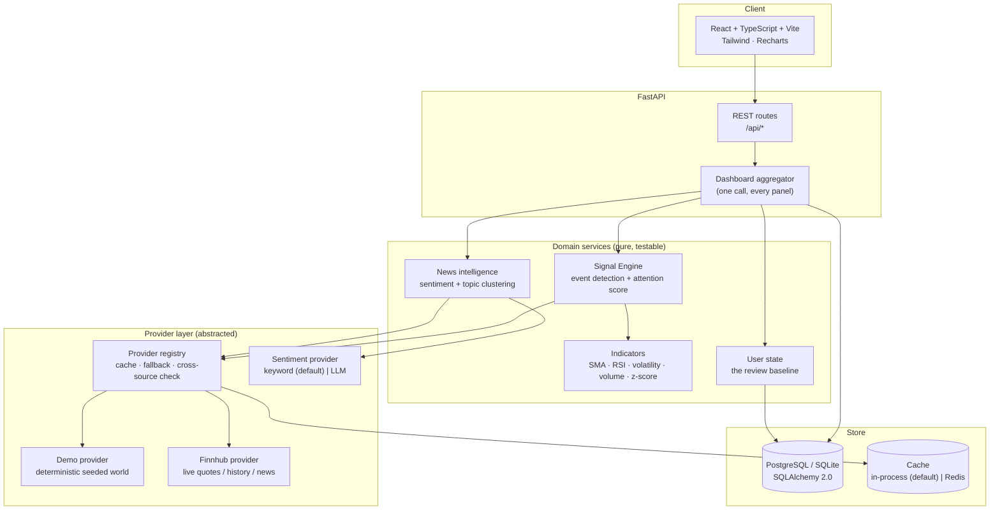
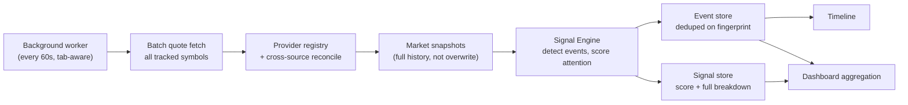

# SignalWatch

### Don't just watch the market. Know what changed.

> Price tells you **what** happened.
> SignalWatch tells you **what changed**, **why it matters**, and **what deserves your attention**.

An explainable smart market watchlist, built for **CODE 2026**.

---

## The problem

Markets generate far more information than anyone can process. Open an ordinary
watchlist after a day away and you get a wall of tickers, prices and coloured
percentages — and you still have to work out, stock by stock, whether anything
actually *happened*. The tool shows you data. It doesn't help you decide where to
look.

## Why ordinary watchlists fail

| Ordinary watchlist | SignalWatch |
|---|---|
| Shows the current price | Shows the change **since you personally last checked** |
| Same view for everyone | State is **per user** — two people with identical watchlists see different priorities because they last reviewed at different times |
| A number went up or down | *Why*: price move, volume anomaly, technical regime change, news cluster — or a combination |
| An opaque "AI score", if any | A **0–100 attention score that is the arithmetic sum of six explained components** |
| Pretends every quote is real-time | Every value is stamped with a **freshness status**; disagreeing sources are **flagged, not silently merged** |
| You scan every row | The **Attention Queue** ranks every stock by how much it deserves you right now |

## The key innovation

Three concepts, executed as well as we could manage:

1. **Since you last checked** — SignalWatch persists what you have *acknowledged*
   (price, volume, score, technical regime, the exact set of live signals, news
   state). When you return, it diffs the live world against that baseline and
   shows only what meaningfully changed. Loading the page does **not** consume
   the deltas — only pressing **Mark all as reviewed** moves your baseline
   forward. That is what makes "visit → market moves → return → the change is
   still there waiting" actually work.

2. **Why this matters** — a written interpretation, not a list of indicators.
   Price *and* volume is confirmation; price *without* volume is suspect; volume
   *without* price is a coiled spring. The engine says which of those it is
   seeing.

3. **Attention Score (0–100)** — six bounded components
   (`price_move`, `volume_anomaly`, `technical`, `news`, `volatility`,
   `recency`), each with a configurable maximum, each reporting its own inputs
   and a human-readable sentence. There is no model. If the UI shows 78, the
   backend can tell you precisely which points came from where, and the numbers
   add up by hand.

---

## Architecture



### Background refresh & event pipeline



---

## Tech stack

| Layer | Choice | Why |
|---|---|---|
| Frontend | React 18 · TypeScript · Vite · Tailwind · Recharts · lucide-react | Fast, typed, no component-library bloat — the UI primitives are hand-written |
| Backend | Python · FastAPI · SQLAlchemy 2.0 · Pydantic v2 | Async API, typed models, OpenAPI for free at `/docs` |
| Database | **SQLite by default**, PostgreSQL via `DATABASE_URL` | Zero-setup demo; the same ORM code runs on Postgres unchanged |
| Cache | In-process TTL cache by default, Redis via `REDIS_URL` | Single-node needs nothing; scaling out is a config change |
| Background work | One daemon thread on an interval | A hackathon does not need Celery; the seam for it is there |
| Market data | `MarketDataProvider` interface → `demo` \| `finnhub` | Swap providers without touching anything above the registry |
| Sentiment | `SentimentProvider` interface → `keyword` (offline, deterministic) \| `llm` | No LLM call per request; deterministic by default |

---

## Setup

### Prerequisites

- Python 3.11+
- Node 18+
- No database server required (SQLite is the default). PostgreSQL optional.

### Backend

```bash
cd backend
python -m venv .venv
# Windows:  .venv\Scripts\activate
# macOS/Linux:  source .venv/bin/activate
pip install -r requirements.txt

cp .env.example .env          # every value has a working default
python seed.py --reset        # create the demo world (see "Seed data" below)
uvicorn app.main:app --reload --port 8000
```

- API: <http://localhost:8000>
- Interactive API docs (OpenAPI): <http://localhost:8000/docs>

### Frontend

```bash
cd frontend
npm install
npm run dev
```

- App: <http://localhost:5173>
- `vite.config.ts` proxies `/api` to `http://127.0.0.1:8000`, so there is no
  CORS in development and no backend host is hard-coded in the client.

### Environment variables

All optional — the app runs with an empty `.env`. Full list and defaults in
[`backend/.env.example`](backend/.env.example). The ones that matter:

| Variable | Default | Purpose |
|---|---|---|
| `DEMO_MODE` | `true` | `true` = deterministic seeded provider, no network, no key. `false` = live provider with demo fallback. |
| `MARKET_PROVIDER` | `finnhub` | Live provider to use when `DEMO_MODE=false`. |
| `FINNHUB_API_KEY` | *(empty)* | Free tier from <https://finnhub.io>. Missing key → automatic, visible fallback to demo data. |
| `DATABASE_URL` | `sqlite:///./signalwatch.db` | Swap for `postgresql+psycopg://…` with no code change. |
| `REDIS_URL` | *(empty)* | Set to use Redis instead of the in-process cache. |
| `WEIGHT_*` | 25/20/15/15/15/10 | The attention-score component maxima. Retune scoring policy without a deploy. |
| `THRESHOLD_HIGH_ATTENTION` / `THRESHOLD_WATCH` | 75 / 45 | Band cut-offs. |
| `DISCREPANCY_TOLERANCE_PERCENT` | `0.75` | Above this, two sources are "in conflict". |
| `SENTIMENT_PROVIDER` | `keyword` | `keyword` (deterministic, offline) or `llm` (Anthropic, falls back to keyword). |

---

## Demo mode

`DEMO_MODE=true` (the default) uses `DemoMarketDataProvider` — a provider that
generates a **reproducible** market world from fixed seeds: identical prices,
volumes and news on every run, with no network and no API key. It implements the
exact same `MarketDataProvider` interface as the live provider and sits behind
the same registry, so the entire application above it is byte-for-byte identical
in both modes. The UI labels it **DEMO DATA** everywhere.

The world is *calibrated*, not merely random. Each symbol carries a `Scenario`
that pins today's move, volume ratio, gap, and the relationship between price and
its moving averages / 52-week range — solved as a fixed point so the constraints
actually hold. The signal engine then genuinely detects a breakout on NVDA and
genuinely detects nothing on MSFT. The intelligence is real; only the market is
synthetic.

Built-in scenarios:

| Symbol | Scenario |
|---|---|
| **NVDA** | Large positive move (+6.8%), volume 2.4×, 50-day crossover + range breakout, positive news cluster → **HIGH ATTENTION** |
| **TSLA** | Negative move, breaks the 50-day average, volatility expansion, negative news cluster, user threshold triggered → **WATCH** |
| **MSFT** | Small move, normal volume, nothing → **STABLE** (the control case) |
| **AAPL** | Moderate move into a genuinely fresh 52-week high |
| **AMZN** | Volume 3.1× on a flat tape → volume divergence |
| **META** | Secondary source disagrees by ~2.9% → **data discrepancy flagged** |
| **NFLX** | Quote timestamp 22 minutes old → **delayed data** shown honestly |
| + INR-denominated NSE names (RELIANCE, TCS, INFY, HDFCBANK) — the app is currency-aware end to end |

### Replay Changes (for the presentation)

The overview page has a **▶ Replay** control. It is **not** a front-end
animation: each step `POST`s to the backend, which advances the demo world's
clock. The provider then returns different data, the signal engine re-detects
events from scratch, and the attention score genuinely re-rates. NVDA moves from
a score in the teens to the high 70s across five steps — and every other
scenario develops in parallel, because the whole session progresses, not just
one stock.

```
10:02  NVDA quiet                     score ~15  STABLE
10:18  volume begins to build         score ~35
10:21  price accelerates on volume    score ~70  WATCH
10:23  news activity increases        score ~74
10:25  breakout confirmed             score ~78  HIGH ATTENTION
```

**Replay → reset** rewinds to the quiet frame *and* re-baselines the demo user
against it, so every subsequent step produces genuine, unseen change — a live
demonstration of the core loop.

---

## API

Full interactive documentation at `/docs`. Key endpoints:

| Method | Path | Purpose |
|---|---|---|
| `GET` | `/api/dashboard` | **Everything the homepage needs, in one call** — market status, since-last-visit, attention queue, watchlists, recent events, data quality |
| `GET` | `/api/changes/since-last-visit` | Meaningful changes only |
| `POST` | `/api/changes/mark-reviewed` | Move the user's baseline to the current world |
| `GET` | `/api/watchlists` · `POST` · `PATCH /{id}` · `DELETE /{id}` | Watchlist CRUD |
| `POST` | `/api/watchlists/{id}/stocks` · `DELETE /{id}/stocks/{symbol}` | Membership |
| `POST` | `/api/watchlists/{id}/reorder` | Drag-and-drop ordering |
| `GET` | `/api/stocks/{symbol}` | Full detail: quote, score breakdown, why-it-matters, events, timeline, news, technicals |
| `GET` | `/api/stocks/{symbol}/history?range=1D\|1W\|1M\|3M\|1Y` | Chart series with 20/50-day MA overlays |
| `GET` | `/api/stocks/{symbol}/signals` | Score + full explanation payload |
| `GET` | `/api/stocks/{symbol}/news` | Topic-clustered news with sentiment |
| `GET` | `/api/config` | The live scoring weights and thresholds |
| `POST` | `/api/demo/replay/step` · `/reset` | Advance / rewind the demo world |
| `GET` | `/api/health` | Liveness + per-source provider health |

---

## The meaningful-change algorithm

### Event detection

The engine emits a normalised, typed `Event` for each thing it observes.
Detection rules are conservative — an indicator is only surfaced when it
represents a genuine *state change*:

| Category | Events | Rule of thumb |
|---|---|---|
| **Price** | `PRICE_MOVE`, `GAP_UP/DOWN`, `NEW_HIGH`, `NEW_LOW` | Move ≥ 2% **or** ≥ 1.5σ for this stock; 52-week extremes measured against the *prior* intraday range, never today's own print |
| **Volume** | `VOLUME_SPIKE`, `VOLUME_DIVERGENCE` | ≥ 1.8× the 20-day average; divergence = heavy volume with < 1% price move |
| **Technical** | `MA_CROSSOVER`, `BREAKOUT`, `BREAKDOWN`, `RSI_REGIME_CHANGE`, `VOLATILITY_SPIKE` | Crossovers require yesterday to have been on the *other* side — the transition, not the state |
| **News** | `NEWS_SPIKE`, `NEWS_SENTIMENT_SHIFT` | ≥ 3 related items in 48h; shift = tone changed vs your last review |
| **User** | `SINCE_VISIT_MOVE`, `USER_THRESHOLD` | Move since *your* baseline ≥ 2%; or your per-stock alert level was crossed |
| **Data** | `DATA_QUALITY_WARNING` | Stale or conflicting data — **earns zero attention points**, but is always shown, so a provider outage is never mistaken for a calm market |

### Attention score

```
Attention Score  =  Σ  component_i          (each clamped to its own maximum, total clamped to 100)

  price_move       ≤ 25   45% absolute move  +  55% move-size relative to this stock's own volatility
  volume_anomaly   ≤ 20   saturating curve on (volume / 20-day average − 1)
  technical        ≤ 15   fixed shares for breakout / crossover / new-high / RSI regime, summed then capped
  news             ≤ 15   45% recent-item count  +  35% directional conviction  +  20% recency
  volatility       ≤ 15   saturating curve on (20-day realised vol / long-run baseline − 1)
  recency          ≤ 10   change since *your* acknowledged baseline: 60% price delta  +  40% new signals
```

Weights are configuration (`WEIGHT_*` env vars). `recency` is the component that
makes two users with identical watchlists see different scores.

### Confidence

A separate 0–1 figure about the *evidence*, not the size of the move. A 7% move
on stale data from a single unverified source scores lower confidence than a 3%
move confirmed by volume across two agreeing sources. Inputs: freshness,
cross-source verification, and corroboration across independent signal families.

### What counts as "meaningful" (for *Since your last visit*)

A change earns a card if **any** of these hold — they are ORed because they are
genuinely different kinds of relevance:

- price moved ≥ 2% vs your baseline
- a new signal appeared that wasn't there at your last review
- the attention band escalated
- the score moved ≥ 15 points
- the technical regime changed (crossed an average, broke support/resistance)
- news flow crossed the spike threshold

---

## Data freshness strategy

Every market data object carries `source`, `source_timestamp`, and a derived
**freshness** band:

| Band | Age (configurable) | UI treatment |
|---|---|---|
| `FRESH` | ≤ 90s | green pulsing dot, "28 sec ago" |
| `RECENT` | ≤ 15m | neutral dot |
| `STALE` | ≤ 6h | amber "⚠ Delayed data", explicit banner on the detail page |
| `UNAVAILABLE` | older / missing | red, and the signal engine emits a `DATA_QUALITY_WARNING` |

Stale data is **never** presented as real-time. When a provider call fails the
registry degrades in order — live → last cached value (labelled stale) → demo
data (labelled) — and the UI says which happened. It never fabricates a number.

## Conflicting data

When cross-source checking is enabled, each quote is fetched from a second
source and compared. If they differ by more than
`DISCREPANCY_TOLERANCE_PERCENT`:

- **both** values are stored (`DataDiscrepancy` row), never silently merged
- the dashboard's *Data quality* panel shows source A, source B, the gap, the
  tolerance, and which value is being displayed **and why** (the more recent
  one wins, and it says so)
- the more-recent value is used for scoring, but the score's confidence drops

## Scalability strategy

*What happens with 10,000 users?*

- **One call renders the homepage.** `/api/dashboard` computes each stock's
  analysis once and slices it into the since-last-visit, attention-queue and
  watchlist views — three panels can never disagree about a score.
- **Batch, not N+1.** Quotes for a whole watchlist are one batch call
  (native in demo mode; a bounded thread pool for a network provider).
- **Cache with stale-read fallback.** Per-data-type TTLs; expired entries are
  retained as labelled fallback rather than evicted. `Cache` is an interface —
  in-process by default, Redis by config, so horizontal scaling is not a
  rewrite.
- **Precompute, don't recompute.** The expensive half of the indicator
  calculation depends only on daily history and is cached on it; only the
  cheap today-dependent parts run per request.
- **Background refresh** keeps quotes warm so a page load reads from cache;
  it pauses while the browser tab is hidden.
- **Indexed for the hot queries.** Composite `(stock_id, timestamp)` indexes on
  the two heavy tables (`market_snapshots`, `events`); every filter/order column
  is indexed.
- **Throttled, deduped writes.** Snapshots/signals are written at most once per
  ~45s per stock; events deduplicate on a stable `fingerprint`, so a volume
  spike that persists for hours is one timeline entry, not hundreds.

## Tradeoffs

- **SQLite default.** Chosen for a frictionless demo. Production would set
  `DATABASE_URL` to Postgres — no code change — and the SQLite-specific pragmas
  and single-connection assumptions fall away.
- **In-thread background worker** instead of Celery/APScheduler. Right call for
  a hackathon; the `Cache` and worker seams are where a real queue would attach.
- **Lexicon sentiment by default.** Deterministic, offline, free, and it makes
  the demo reproducible. It handles simple negation but will misread heavy
  sarcasm or deep context. The `llm` provider is a drop-in for when quality
  matters more than determinism.
- **Single live provider implemented (Finnhub).** The second cross-check source
  in live mode needs its own credentials; rather than invent one we report
  `single_source` honestly. Adding one is a single line once its provider class
  exists — the demo mode fully exercises the conflict path.
- **Demo `Scenario` calibration is iterative** (a fixed-point solve). It
  converges quickly and is cached, but it is the one genuinely intricate piece
  of the codebase — the cost of wanting the synthetic market to trigger *real*
  detections rather than hard-coding outcomes.

## Future improvements

- Real authentication (the `UserResolver` seam is already in place)
- WebSocket push for live score updates instead of 60s polling
- A proper job queue + worker fleet for background refresh at scale
- More live providers (Polygon, Alpha Vantage) behind the same interface, with
  true multi-source verification in live mode
- Per-user weight tuning ("I care more about volume than news")
- Alembic migrations for schema evolution on Postgres
- Backtesting the attention score against realised forward volatility

---

## Testing

```bash
cd backend
pytest -q          # 84 tests
```

Coverage focuses on the parts that carry product risk:

- **Signal engine** (pure-function unit tests): score = sum of components,
  every component respects its configured max, relative vs absolute move,
  each event type's detection rule, stale/conflict handling earning zero
  attention points, determinism.
- **Indicators**: RSI (Wilder's), volatility annualisation, z-score flooring
  for degenerate series, support/resistance excluding today's bar, 52-week
  range from intraday highs.
- **Providers**: demo determinism, every universe symbol quotes with ≥ 252
  bars, each calibrated scenario actually triggers its intended detection,
  freshness classification, cross-source discrepancy detection.
- **API**: watchlist CRUD, add/remove/reorder, dashboard shape and ordering,
  the full **core loop** —
  `visit → market changes → return → change is detected → mark reviewed → it clears` —
  and the guarantee that *opening the dashboard does not move the baseline*.

---

## Project structure

```
backend/
  app/
    main.py                  FastAPI app, middleware, structured error handlers
    config.py                every tunable, incl. the attention-score weights
    models.py                SQLAlchemy models + indexing strategy
    auth.py                  UserResolver seam (demo user; JWT-ready)
    cache.py                 Cache interface — in-process | Redis
    providers/
      base.py                MarketDataProvider interface + freshness types
      demo.py                deterministic seeded world + replay scenarios
      finnhub.py             live provider (retries, timeouts, typed errors)
      registry.py            selection · caching · fallback · cross-source reconcile
      sentiment.py           SentimentProvider — keyword | llm
    services/
      signal_engine.py       ← the product. detection + explainable scoring. pure.
      indicators.py          SMA / RSI / volatility / volume / z-score. pure.
      analysis.py            provider → indicators → engine → persistence
      dashboard.py           one-call homepage aggregation
      user_state.py          the review baseline (visit ≠ review)
      news.py                sentiment at ingest + topic clustering
      watchlists.py          watchlist domain logic
      world.py               replay world state
  seed.py                    builds the "before" baseline, then moves the world
  tests/

frontend/
  src/
    lib/          api client · types · formatting (green/red = money only)
    hooks/        useApi (stale-while-revalidate) · useToast
    components/   ScoreBreakdown · ChangeCard · AttentionQueue · ReplayControl
                  DataQualityPanel · PriceChart · SignalTimeline · NewsClusters
    pages/        Dashboard · StockDetail · Watchlists · Signals · Activity
```

---

## Disclaimer

SignalWatch surfaces market changes for informational purposes. It does not
provide investment advice. It shows **HIGH ATTENTION / WATCH / STABLE**, never
buy or sell.
